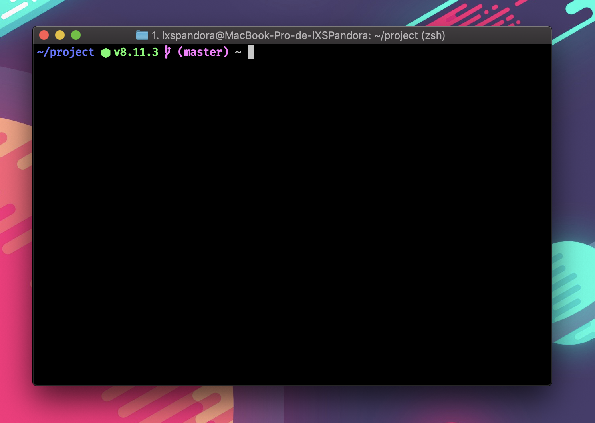
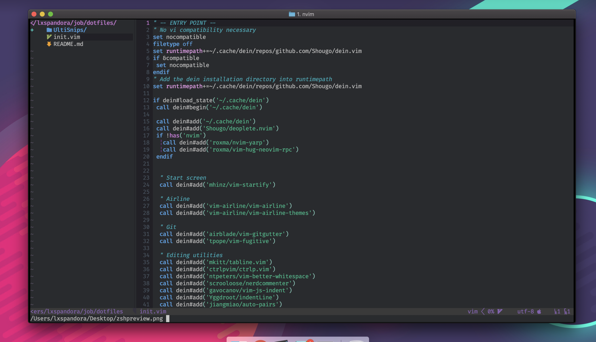
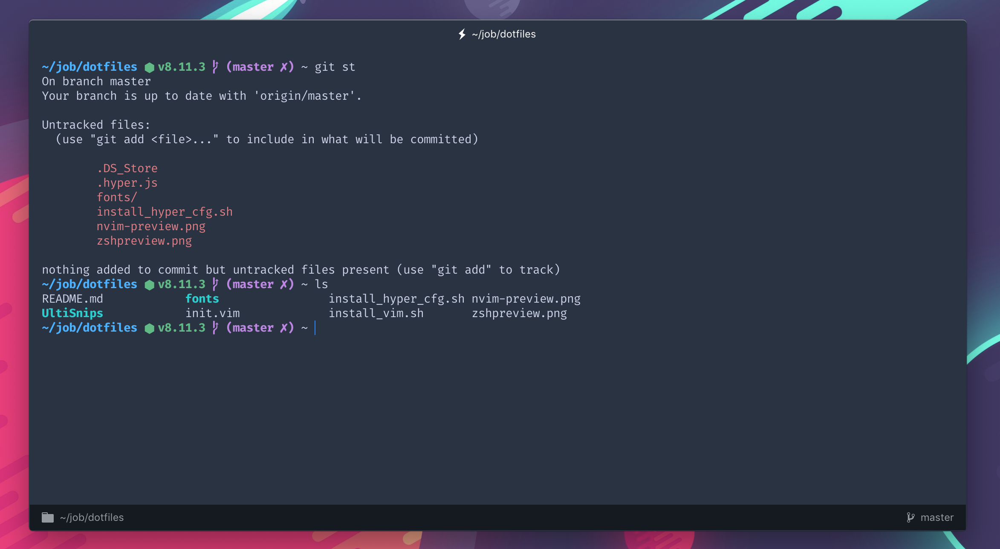

# My Dotfiles

## Vim

- Install neovim `https://github.com/neovim/neovim/wiki/Installing-Neovim`
- Run `sh install_vim.sh` or `sudo sh install_vim.sh`
- Open NeoVim running `nvim` and run `:call dein#install()`
- Done! your vim has been configured with sucess

## Fonts

- All the fonts that i use on the terminal and on the NeoVim are located on the `fonts` directory

- Credits to:
https://github.com/ryanoasis/nerd-fonts, https://github.com/tonsky/FiraCode

## Hyper

- Install Hyper `https://hyper.is/`
- run `sh install_hyper_cfg.sh`

## Git
- Install GIT configs
- run `cp .gitconfig ~/.gitconfig`

## ZSH

- Install zsh running `brew install zsh`
- Run `brew install exa`
- Install spaceship-prompt (https://github.com/denysdovhan/spaceship-prompt)
  `inpm install -g spaceship-prompt`
- And install android-studio sdk

## Preview

### ZSH

### NeoVim

### Hyper

